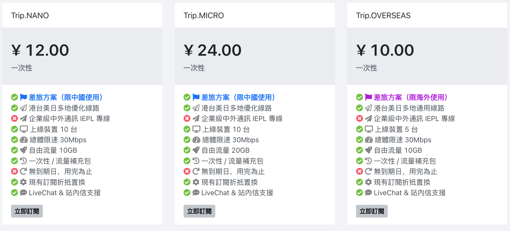
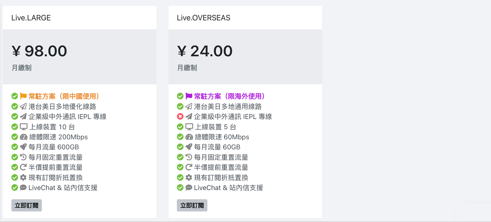

## Traveler VPN 簡介

台灣團隊常駐中國七年，對付天朝網路封鎖，我們有豐富的經驗，是台商台幹們最貼心的上網助手！

立即註冊：[https://getrapps.org/#/login?code=tw](https://getrapps.org/#/login?code=tw)

⬇⬇⬇⬇⬇ 往下看更多介紹（文末有優惠券）  ⬇⬇⬇⬇⬇

* * *

## 資費方案選擇

### 總覽

* * *

### 情況一：短期到中國大陸出差或旅遊

推薦如下方案：

| **方案** | Trip.NANO | Trip.MICRO |
|:--- |:--- |:--- |
| **價格** | ¥12 | ¥24 |
| **週期** | 一次性流量包 | 一次性流量包 |
| **流量** | 10GB | 20GB |
| **線路** | 約 9-12 線路 無 IEPL 專線 | 約 9-12 線路 無 IEPL 專線 |
| **速率** | 30Mbps | 30Mbps |
| **機制** | 用完為止，永不過期 可隨時自助換購到其他方案 | 用完為止，永不過期 可隨時自助換購到其他方案 |
| **特色** | 適合短期差旅 低資費，輕用量 時間彈性，流量自由 | 適合短期差旅 低資費，輕用量 時間彈性，流量自由 |

> 註：我司的差旅方案主推「流量自由」，不設每月清零重置，沒有月租壓力，也不按天計費，性質類似「流量包」，因此不設 30 日以下的包日方案。如果您預計用量遠超 Trip 系列方案，建議直接看 Work 和 Live 系列的流量做選擇。

* * *

### 情況二：在中國大陸常駐工作或已定居

推薦如下方案：

| **方案** | Work | Live |
|:--- |:--- |:--- |
| **價格** | ¥18 起 | ¥28 起 |
| **週期** | 月付 / 季付 / 半年付 / 年付 每月固定重置流量 | 月付 / 季付 / 半年付 / 年付 每月固定重置流量 |
| **流量** | 30GB / 120GB / 240GB | 60GB / 120GB / 360GB / 600GB |
| **線路** | 約 9-12 線路 無 IEPL 專線 | 約 15-20 線路 有 IEPL 專線 |
| **速率** | 100Mbps | 200Mbps |
| **機制** | 沒用完不遞延 不夠用可 5 折重置 可隨時自助換購到其他方案 | 沒用完不遞延 不夠用可 5 折重置 可隨時自助換購到其他方案 |
| **特色** | 適合外派或已定居 固定資費，固定用量 滿足網頁 / 通訊 / 影音 / 遊戲各類需求 | 適合外派或已定居 固定資費，固定用量 滿足網頁 / 通訊 / 影音 / 遊戲各類需求 |

> 註：舉例來說，若於本月 15 日購買則於下月 15 日重置，購買後於網頁和軟體內訂閱資訊也會顯示下次重置時間；若提前用完，可在首頁點選「重置已用流量」，花 5 折費用，即可重新獲得整月流量，但請知悉此流量到下月 15 日會再次被固定重置，故請斟酌用量再買。詳細規則敬請參閱官網教學庫中的《平台 & 產品介紹》一文。

* * *

### 情况三：都不夠用？有特殊需求？

我司承接專案訂製，可指定 **「流量」**、**「線路品質」**、**「所在區域」** 及 **「解鎖特定服務」**，三個月起訂，其餘詳洽。**（頁尾有聯絡方式）**

不接：「從台灣翻回大陸」或涉及實體產品（例：路由器）之業務。

* * *

## 您關心的其他問題

### 1. 可以試用嗎？

新客戶註冊立享 12 小時免費試用，滿意再買！

**<u>請注意：因為網路條件的特殊性，所有線路的測試和使用均需在中國網路環境下才準確。</u>**

### 2. 是否要在台灣先買？

通常不需要！Traveler 官網並未封鎖（是指註冊登入後的頁面），我們的客戶一般在中國境內即可隨時續訂購買！

如果您是第一次過來，會擔心的話，可以先註冊、安裝軟體，看看教學，甚至在前一天晚上購買訂閱並設定好。

**<u>但請知悉：所有 VPN 線路皆為中國網路環境設計，所以在台灣測試連線效果是完全不準確的！請務必了解此差異！</u>**

當您在台灣設定完成後，請一律關閉連線開關，以免影響您裝置的網路狀態，等入境中國大陸後再根據各軟體步驟中的「啟動連線」開始使用！

### 3. 入境後會打不開官網？

請知悉，您現在看到的本頁面是有機會被封鎖的，只做海外宣傳使用！

如果您有意購買我司方案，請務必另外註冊並收藏官網用戶中心的網址【[https://getrapps.org](https://getrapps.org/)】，入境後一樣可以打開。

為保證未來官網網頁不被封鎖，其他更詳細資訊需要註冊後瀏覽！新用戶可以善用本頁瞭解基本資訊，更多疑問也可以洽詢線上客服，或徑行前往官網註冊並參閱教學庫的內容。但請不要只收藏本頁面喔！

### 4. 變更服務方案或流量

首次購買後，如果還沒到期，覺得方案不敷使用想換，或流量太多想降低怎麼辦？非常簡單！不多花一分錢，不耽誤一分鐘，說換就換！

請在「購買訂閱」頁面，隨心選擇您想要的方案和週期，直接購買！**<u>舊方案將自動折抵、退補差價</u>**（結帳前可瀏覽試算介面），多退的金額會退到您的網站餘額，少補的部份可透過網頁上的付款方式自助付款，完成後即可開始使用新方案！

請注意：如果您購買了與之前不同名的方案，各線路權限及數量可能會有所不同，請在裝置上「更新訂閱」，以便正常連線！

### 5. 當月流量不夠用

**<u>Work 和 Live 系列方案都設有免費固定重置流量的機制</u>**，當您感覺平時都很夠用，但突然需要臨時流量，固定重置頻率不敷所需怎麼辦？很簡單！當月執行一次「付費重置」即可！

您可在【用戶中心首頁 -> 我的訂閱】下方看到「重置已用流量」按鈕，此按鈕平時不顯示，**<u>為防誤按，「付費重置」功能僅在您流量已用到 80% 以上才可用。</u>**

按下按鈕會跳轉到付款頁面，完成付款後，您的當月流量將自動重置歸零為未使用狀態。各方案重置價格通常為月付價格的 5 ~ 8 折，實際價格以方案內容標註為準。

### 6. 怎麼聯絡

* 登入【用戶中心 -> 聯絡客服】，此為人工聯絡單，任何時間均可傳送訊息，工作時間回覆。
* （無須註冊及登入）打開【用戶中心 - > 右下角線上客服對話】，可傳即時或離線訊息，工作時間回覆。未註冊可在客服對話前的 **「網站帳號」** 欄填入其他個人 Email。
* Line 客服：請搜尋【@travelervpn】加我們官方帳號為好友（搜尋要加@），任何時間均可傳送訊息，工作時間回覆。
* Email：[service@getrapps.com](mailto:service@getrapps.com) 任何時間均可傳送訊息，工作時間回覆。

* * *

## 優惠券碼

廣告渠道專屬優惠！！凡透過本頁面取得優惠券碼均可使用，有效期限依實際官網下訂為準。

### 半年 9 折優惠

- 優惠券碼：**FB2025-6MONTH**
- 適用方案：Work.STARTER 以上方案，Live.STARTER 以上方案
- 適用週期：半年付

### 年付 85 折優惠

- 優惠券碼：**FB2025-12MONTH**
- 適用方案：Work.STARTER 以上方案，Live.STARTER 以上方案
- 適用週期：年付

* * *

立即註冊：[https://getrapps.org/#/login?code=tw](https://getrapps.org/#/login?code=tw)

* * *

歡迎隨時購買，隨時續訂，隨時換方案，隨時重置流量，讓您如入無牆之境，實現真正的上網自由！

走過路過不要錯過哦~

* * *

我們的 Blog： [旅行者 - Zestro 的天朝網路見聞和 3C 雜談](https://zestro.eu.org/)

我們的 Line： [Traveler VPN](https://line.me/R/ti/p/@xmb5854z)

我們的 Facebook： [Traveler VPN 跨境網路服務](https://www.facebook.com/traveler.vpn/)

我們的 Telegram： [Traveler 客服助手](https://t.me/traveler_push_bot)
